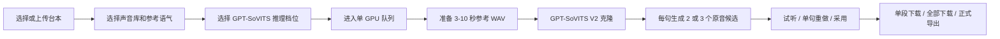

# Voice Lab

Voice Lab 是公司局域网使用的 GPT-SoVITS V2 声音克隆工具。它只负责根据真人声音模板生成角色台词原音，不做降噪、变调、共振峰、EQ、压缩、混响、响度统一或其他后期处理。

浏览器无需账号密码。首次访问会分配匿名 ID，普通用户只看到自己的生成记录；服务器本机管理员可查看全部任务。所有 GPU 推理进入同一个队列，避免多人同时生成导致显存溢出。

## 启动

Windows 服务器可直接双击：

```text
start_voice_lab.bat
```

也可在 PowerShell 中运行：

```powershell
cd C:\Workspace\Git\voice
.\run_web.ps1
```

服务默认监听 `0.0.0.0:18082`：

- 本机工作台：<http://127.0.0.1:18082/>
- 本机管理员：<http://127.0.0.1:18082/admin>
- 局域网用户：`http://服务器局域网IP:18082/`

Windows 防火墙只需为 TCP `18082` 放行 `LocalSubnet`。生产环境保持单个 Uvicorn worker，否则每个进程都会重复加载一份 GPU 模型并拆散任务队列。

## Docker

首次部署前，按需手工复制一次现有 Web 数据：

```powershell
.\.venv-gpt-sovits\Scripts\python.exe docker\prepare_data.py
```

然后运行：

```powershell
.\docker_voice_lab.bat
```

代码更新后重建：

```powershell
.\docker_voice_lab.bat build
```

容器会继续挂载 `docker-data`、`input`、`output` 和本机 GPT-SoVITS 模型，不会把已有数据打进镜像。详细说明见 [docker/README.md](docker/README.md)。

## 工作流程



参考录音在送入模型前会做必要的格式准备：解码、转单声道、重采样、裁剪首尾静音和防止削波。这些操作只作用于模型输入，不会对生成结果做声音后期。

生成结果由 GPT-SoVITS 直接写为 16-bit PCM WAV。新任务中的 `audio_path` 与 `raw_audio_path` 指向同一个文件，不会额外复制所谓“成品”。

## Web 功能

- 新建任务可选择已有台本或上传 `.txt`、`.md`、`.csv`、`.docx`。
- 声音库支持 WAV、MP3、M4A、AAC、FLAC、OGG、OPUS，可上传多条真人录音并按参考语气分组。
- 每句生成 2 或 3 个候选；候选可试听、下载、采用，也可修改台词、发音、尾音方向和 GPT 推理参数后重做。
- 页面任意时刻只播放一段音频，新播放会自动暂停上一段。
- “全部下载”下载当前任务每段的默认克隆音频；“正式导出”下载每段已采用候选及 `UnityAudioManifest.json`。
- 普通用户只能查看自己的任务和编辑自己创建的声音库；管理员页面可查看所有用户任务。

已存在的 SQLite、任务、上传和音频不会被删除。历史 DSP 文件仍保留在原目录中，但页面与 API 不再展示或创建调音版本；历史任务试听和下载优先使用其 GPT 原音路径。

## 台本格式

推荐一行一段，用竖线分隔正常台词和发音：

```text
陌生人，可否听我讲一段故事 | mo——la，na？↗
你肯定知道我爷爷的故事 | GU-la……gu-la-da。↘
```

也支持 Tab 分隔：

```text
正常中文台词<TAB>发音标记
```

CSV 必须包含 `text` 和 `pronunciation`，也兼容中文表头 `台词`、`发音`：

```csv
text,pronunciation
陌生人，可否听我讲一段故事,"mo——la，na？↗"
```

发音规则：

- `-` 只分隔音节。
- `↗` 和 `↘` 会转换为问句或陈述句标点，可能影响模型尾音，但生成存在随机性。
- 中文长横杠 `—` 与连续数量会保留在页面和下载清单中，供外部后期参考；送入 GPT-SoVITS 前会移除，本工具不自动延音。
- 大写音节会保留为重音标记，供录音指导或外部后期参考，本工具不做重音 DSP。
- 未知拟声音节会在提交时返回具体行号。

网页上传区可直接下载格式模板和完整发音说明。

## 声音模板

建议每条录音 3-15 秒，同一声音库准备 2-6 条：

- 近距离、无背景音乐、无明显房间混响。
- 一个文件只保留一个人的声音。
- 咬字、速度、气息和情绪尽量接近目标角色。
- 年龄感和表演情绪应优先由真人录制完成，后续再交给专业音频软件处理。

上传文件会统一保存为单声道、48 kHz、16-bit PCM WAV，原始文件名仍会显示在声音库中。单条录音最长 120 秒，超长素材应先拆分；实际模板仍建议每条 3-15 秒。

## 模型档位

`web/config/profiles.json` 当前提供两个 GPT-SoVITS V2 推理档位：

- `稳定`：较低随机性，节奏和咬字更稳。
- `表现`：较高随机性，语气变化更明显。

它们使用同一套 GPT-SoVITS V2 权重，只是 `top_k`、`top_p`、`temperature` 和 `repetition_penalty` 不同。单句重做还可调整这些参数及 `speed_factor`；这些都是模型推理参数，不是音频后期参数。

## 目录

```text
C:\Workspace\Git\voice
├─ code/
│  ├─ gpt_sovits_audio.py       音频解码、重采样和参考音构建
│  ├─ gpt_sovits_clone.py       GPT-SoVITS 模型加载、推理和原音输出
│  ├─ gpt_sovits_config.json    模型与参考音配置
│  └─ download_gpt_sovits_models.ps1
├─ voice_core/                  发音解析与标记规则
├─ web/
│  ├─ app/                      FastAPI、队列、持久化和引擎适配
│  ├─ static/                   Web 页面
│  ├─ config/profiles.json      GPT 推理档位
│  └─ data/                     SQLite、上传、任务和导出
├─ docker/                      Docker 构建、部署与数据准备
├─ input/                       旧输入，仅用于幂等登记
├─ output/                      旧输出，仅作为历史数据
├─ run_web.ps1                  PowerShell 启动入口
├─ start_voice_lab.bat          Windows 双击启动入口
└─ run_tests.ps1                后端与前端检查
```

新任务音频目录：

```text
web/data/jobs/<job-id>/
├─ reference.wav
├─ audio/001.wav
└─ candidates/001/<candidate-id>/audio.wav
```

## 测试

```powershell
cd C:\Workspace\Git\voice
.\run_tests.ps1
```

测试使用临时 SQLite 和假声音引擎，不加载 GPU，也不会修改 `input`、`output`、`web/data` 或 `docker-data`。
